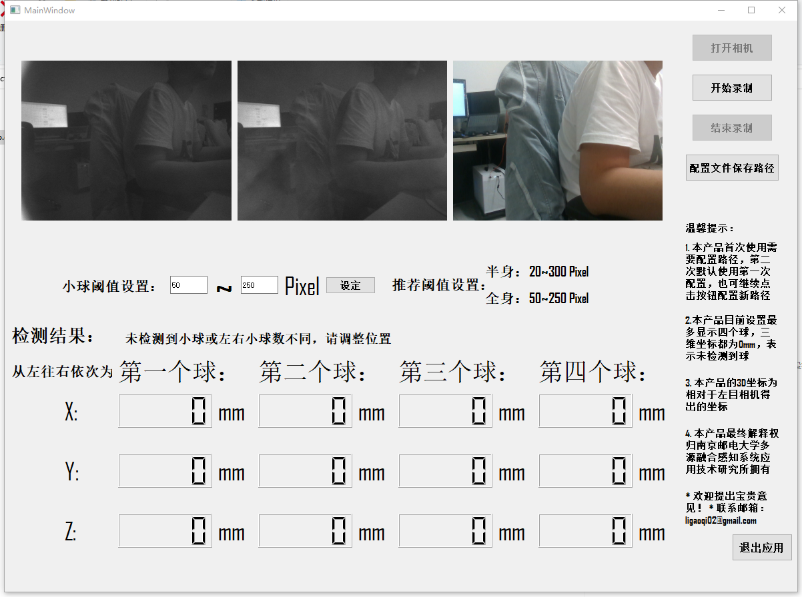

# Realsense_Infrared_Ball_Tracking_UI_App
## Here is an Infrared-Balls Tracking UI App based on Intel-Realsense, you will get the 2D, 3D position of the balls.

This repository is based on [Orignal Version](https://github.com/ligaoqi2/Realsense_Infrared_Ball_Tracking), this one is the UI version.


### Attention
Before you running the program, please make sure you have already connected the realsense, attached the visible light shielding sheet on two infrared cameras, blocked the laser dot matrix and placed diffuse infrared light source.

### Environments
```
conda create -n InfrareTrackingUIApp python=3.9
conda activate InfrareTrackingUIApp
pip install -r requirements.txt
```

### Run the App

1. python InfraredBallApp.py
2. For Windows user, the exe is ready in [InfraredApp](https://drive.google.com/file/d/1atKXfsnSyla1s4_VDUv0xLTP_gddMeFk/view?usp=drive_link)

### The view will like this


### Contact
```
ligaoqi02@gmail.com
```